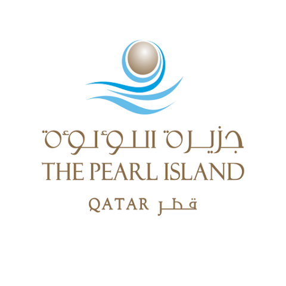
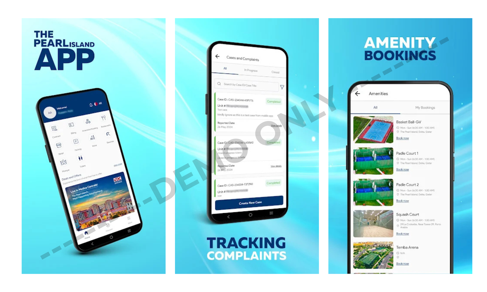

# 🦪⚪ Pearl Island (For Demo Use Only)
### Industrial Portfolio — UI Showcase  
**Note:** This application belongs to **UDC Group, Qatar**, officially developed through **Systems Limited**.  
This repository is created **only for demo and presentation purposes** to showcase UI work, feature integrations, and contributions.

---

## 📌 About the App

**Pearl Island** is a premium community management mobile application for residents of *The Pearl Qatar*.  
It provides users with a digital ecosystem for:

- 🚗 Limousine booking (ride-hailing style)  
- 🍽️ Exploring food outlets  
- 🏷️ Viewing commercial activities  
- 🧾 Accessing maintenance bills & payments  
- 🏘️ Community service features

This demo repository does **not** contain production code, backend logic, or any proprietary implementation.  
It only includes **visual previews** strictly for portfolio and hiring review.

---

## 👨‍💻 My Role & Contributions

I worked on the **Limousine Booking module**, including:

- 🛰️ **Google Maps real-time tracking integration**  
- 🚕 **Live driver tracking & ride status flow**  
- 👤 **Dynamic user–driver position updates**  
- ⚙️ **Optimized location polling and smooth map markers**  
- 🔧 **Bug fixes and ride-flow improvements**  
- 🎨 **UI refinements & screen transition enhancements**

This portfolio highlights the **core ride-hailing and tracking features** I contributed to, without exposing proprietary logic.

---

## 🧩 Demo Assets Included  

This repository contains **only the following items**:

- ✔ App Icon  
- ✔ Two landscape showcase strips (displaying multiple screens)  
- ❌ No source code  
- ❌ No backend logic  
- ❌ No proprietary files  

Everything is provided **strictly for visual demonstration**.

---

## 🖼️ Visual Preview

### **App Icon**

---

### **Showcase — Landscape Preview 1**

---

### **Showcase — Landscape Preview 2**

---

## 📥 Download (Official Links)

> Note: These belong to the official Pearl Island app by UDC Group, not this portfolio demo.

**Google Play:**  
[View it on Google Play](https://play.google.com/store/apps/details?id=com.udc.thepearl&hl=en)

**App Store:**  
[View it on App Store](https://apps.apple.com/pl/app/the-pearl-island/id6444149000)

---

## 📄 Disclaimer

This repository is **not affiliated with, endorsed by, or officially representing UDC Group, Pearl Island, or Systems Limited**.  
It is intended **solely to demonstrate my UI development and integration work**.  
All rights to the original application belong to **UDC Group – Qatar**.

---

## 📬 Contact

For professional work, collaborations, or UI development:

**Email:** hamzabilalgaya.bilal@gmail.com  
**LinkedIn:** https://www.linkedin.com/in/hamza-bilal-g-4259a8181  
**Fiverr:** https://www.fiverr.com/s/EgZdxBK  
**Upwork:** https://www.upwork.com/freelancers/~01474d05eaa4a6e38b

---

## ⭐ Support My Work

If you like my work and want to support future UI components, tutorials, and open source:

### ☕ **Buy Me a Coffee**  

